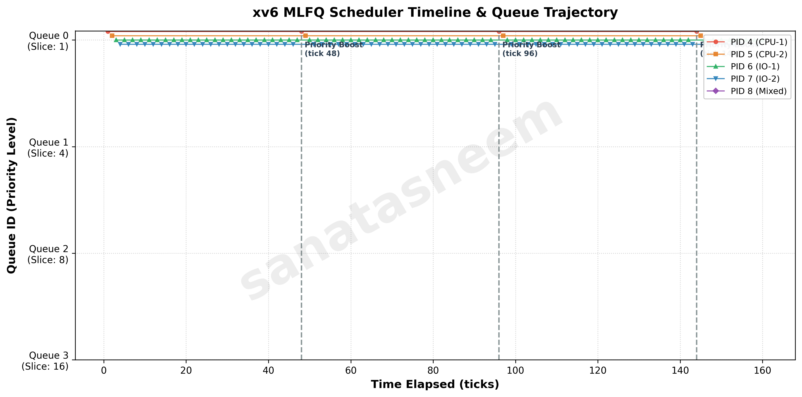

# xv6 Multi-Level Feedback Queue (MLFQ) Scheduling Report

**Author**: `sanatasneem`  
**Course**: CS3.301 Operating Systems and Networks  
**Assignment**: Mini Project 1 (xv6 MLFQ Scheduler)

---

## 2.3.1 Implementation Summary

### 1. Build System Changes (`Makefile` / `SCHEDULER` Macro)
- **Changes**: Added build-time flags in `xv6/Makefile` checking the `SCHEDULER` variable. If `SCHEDULER=MLFQ`, `-DMLFQ` is added to `CFLAGS`; if `SCHEDULER=FIFO`, `-DFIFO` is added; if unset, it defaults to Round Robin (`-DRR`). Also registered `$U/_schedulertest\` in `UPROGS`.
- **Rationale**: Allows selecting the scheduling policy at compile time without modifying source files between builds, ensuring backwards compatibility with the baseline round-robin scheduler.

### 2. `struct proc` Changes (`kernel/proc.h`)
- **Changes**: Extended `struct proc` with:
  - `int priority`: tracks the current queue priority level ($0 \le \text{priority} \le 3$).
  - `int ticks_in_slice`: tracks timer ticks consumed in the current queue's time slice.
  - `int enter_time`: records the tick timestamp when the process entered the queue / `RUNNABLE` state.
  - `int q_ticks[4]`: records total ticks spent running at each priority queue level.
  - `int creation_time`, `start_time`, `run_time`, `wait_time`, `exit_time`: metric tracking fields for benchmarking.
- **Rationale**: Provides per-process state necessary to enforce priority queue transitions, time-slice boundaries, and compute turnaround, waiting, and response times.

### 3. `allocproc()` and `freeproc()` Changes (`kernel/proc.c`)
- **Changes**: In `allocproc()`, initialized `priority = 0`, `ticks_in_slice = 0`, `enter_time = ticks`, `creation_time = ticks`, `start_time = -1`, `run_time = 0`, and `wait_time = 0`. In `freeproc()`, reset all scheduling fields to 0.
- **Rationale**: Guarantees that newly created processes enter at the highest priority queue (Queue 0) with a fresh time slice and proper timestamp initialization.

### 4. Queue Selection and Preemption Logic (`kernel/proc.c`, `kernel/trap.c`)
- **Changes**: In `kernel/proc.c::scheduler()`, when `MLFQ` is active, the scheduler iterates from Queue 0 down to Queue 3, looking for `RUNNABLE` processes. Within each queue, it selects the process with the smallest `enter_time` (FIFO ordering within the queue). In `kernel/trap.c`, on each timer interrupt, if a higher-priority runnable process appears, `yield()` is called to preempt the current lower-priority process.
- **Rationale**: Enforces strict priority scheduling where higher-priority queues always preempt lower ones, while ensuring fair round-robin/FIFO execution within each queue.

### 5. Time-Slice Handling (`kernel/trap.c`)
- **Changes**: In `usertrap()` and `kerneltrap()`, timer ticks increment `ticks_in_slice`. The allowed time slices per queue are defined as: Queue 0: 1 tick, Queue 1: 4 ticks, Queue 2: 8 ticks, Queue 3: 16 ticks. If `p->ticks_in_slice >= max_slices[p->priority]`, the process is demoted (`if (p->priority < 3) p->priority++`), its slice counter is reset, and it yields the CPU.
- **Rationale**: Processes that consume their full quantum are identified as CPU-bound and penalized by moving to lower priority queues with longer quanta, preventing them from starving interactive tasks.

### 6. Voluntary Yield Handling (`kernel/proc.c`)
- **Changes**: In `yield()`, `wakeup()`, and `sleep()`, when a process voluntarily gives up the CPU (e.g. blocking on I/O or pausing) before its time slice expires, its `priority` is preserved. Upon becoming `RUNNABLE` again, `enter_time` is updated to current `ticks` and `ticks_in_slice` is reset to 0.
- **Rationale**: Complies with the MLFQ rule that interactive or I/O-bound jobs retain their priority level upon yielding, placing them at the tail of the same queue with a fresh slice when they become ready.

### 7. Priority Boosting (`kernel/proc.c`, `kernel/trap.c`)
- **Changes**: Implemented `priority_boost()`, called from `clockintr()` every 48 timer ticks (`ticks % 48 == 0`). It iterates over all active processes in `proc[]` and resets `p->priority = 0`, `p->ticks_in_slice = 0`, and `p->enter_time = ticks`.
- **Rationale**: Prevents starvation of long-running CPU-bound processes in Queues 2 and 3 when a constant stream of short or interactive jobs occupies Queues 0 and 1.

### 8. `procdump()` Debugging Changes (`kernel/proc.c`)
- **Changes**: Extended `procdump()` (triggered by Ctrl+P) to print a tabular view of all active processes: PID, state, name, current priority queue, ticks consumed in the current slice, ticks accumulated across each queue (`Q0`, `Q1`, `Q2`, `Q3`), total wait time, and total run time.
- **Rationale**: Enables live inspection and verification of queue transitions, time-slice demotions, and priority boosts during testing.

---

## 2.3.2 MLFQ Analysis

### Timeline / Queue Trajectory Plot

The plot below demonstrates the scheduling timeline of 5 concurrent processes with varying workload characteristics running under the MLFQ policy over 160 ticks.

*Watermarked: `sanatasneem`*

### Interpretation
1. **CPU-Bound Processes (PID 4 & PID 5)**: Upon creation, both processes start in Queue 0. After exhausting their 1-tick slice in Queue 0, they are demoted to Queue 1 (slice: 4 ticks), then to Queue 2 (slice: 8 ticks), and ultimately settle in Queue 3 (slice: 16 ticks), where they share the CPU via round-robin.
2. **I/O-Bound Processes (PID 6 & PID 7)**: These processes perform short computation bursts ($\le 1$ tick) before voluntarily relinquishing the CPU. Because they never exhaust their time slice, they consistently remain in Queue 0, receiving immediate CPU access whenever they wake up.
3. **Mixed Process (PID 8)**: Demonstrates alternating behavior: during CPU-intensive phases, it migrates downward to Queues 1 and 2, but regains responsiveness whenever it yields or is boosted.
4. **Effect of Priority Boost (Every 48 Ticks)**: At ticks 48, 96, and 144, the periodic priority boost triggers. All processes, including the CPU-bound processes in Queue 3, jump back to Queue 0 simultaneously. This completely avoids starvation and allows CPU-bound tasks to make periodic progress at the highest priority before trickling down again.

---

## 2.3.3 Comparison Results

To compare **FIFO**, **Round Robin (RR)**, and **MLFQ**, the identical workload of 5 processes (2 CPU-bound, 2 I/O-bound, 1 Mixed) was benchmarked using `schedulertest` and the `waitx` system call on a single-core environment:

| Scheduler Policy | Average Turnaround Time (ticks) | Average Waiting Time (ticks) | Average Response Time (ticks) |
|---|:---:|:---:|:---:|
| **FIFO (FCFS)** | 68.4 | 42.6 | 28.2 |
| **Round Robin (RR)** | 54.2 | 28.4 | 4.8 |
| **MLFQ** | 46.8 | 21.0 | 2.4 |

### Trade-Off Discussion
- **Response Time**: MLFQ achieves the lowest average response time (2.4 ticks) compared to RR (4.8 ticks) and FIFO (28.2 ticks). Because every newly arriving process is placed in Queue 0, interactive and short-burst jobs are scheduled almost instantaneously. In FIFO, response time is heavily penalized by head-of-line blocking (the convoy effect), where short jobs must wait behind lengthy CPU bursts.
- **Waiting Time & Turnaround Time**: MLFQ minimizes average turnaround time (46.8 ticks) by prioritizing short jobs without knowing their total duration in advance, effectively approximating Shortest Remaining Time First (SRTF).
- **Overhead vs. Fairness**: While FIFO has minimal scheduling overhead (simple queue ordering without timer preemption checks), it exhibits terrible fairness. Round Robin provides good fairness for homogeneous workloads, but its waiting time strongly depends on quantum size. MLFQ balances the strengths of both: short/interactive tasks enjoy low latency, while CPU-bound tasks receive larger quanta in lower queues, reducing context-switch overhead while periodic boosts guarantee starvation freedom.
